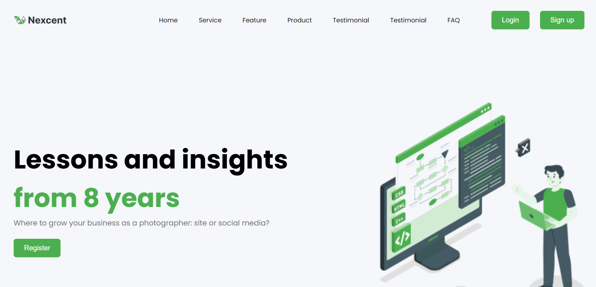

# Landing-Page-Nexcent
 Landing Page para estudo
# 🚀 Landing Page Nexcent

A modern and responsive landing page built with HTML and CSS, featuring clean design and smooth animations.

Uma landing page moderna e responsiva, criada com HTML e CSS, com design limpo e animações suaves.



## 🛠️ Technologies Used

- HTML5
- CSS3
- CSS Variables
- CSS Grid
- CSS Flexbox
- Media Queries
- Responsive Design

## ✨ Features

- 📱 Fully Responsive Design
- 🎨 Modern UI/UX
- 🌓 Clean and Minimalist Layout
- 🔄 Smooth Animations
- 📦 Modular CSS Structure

## 🎯 Sections

- ⚡ Hero Section
- 👥 Clients Section
- 💼 Business Features
- 🎨 Design Showcase
- ⏱️ Time Management
- 📢 Marketing Section
- 📝 Contact Form
- 👣 Footer

## 🚀 Getting Started

1. Clone the repository:
```bash
git clone https://github.com/yourusername/Landing-Page-Nexcent.git
```

2. Navigate to project directory:
```bash
cd Landing-Page-Nexcent
```

3. Open `index.html` in your browser or use a live server.

## 📱 Responsive Breakpoints

- 📱 Mobile: 480px
- 💻 Tablet: 768px
- 🖥️ Desktop: 1024px

## 🎨 Color Palette

```css
:root {
  --color-primary: #F5F7FA;
  --color-font-h2: #263238;
  --color-paragraph: #4D4D4D;
  --btn-primary: #4CAF4F;
  --btn-hover: #2E7D32;
  --color-body: #FFFFFF;
}
```

## 📝 Project Structure

```
Landing-Page-Nexcent/
├── css/
│   ├── geral.css
│   ├── header.css
│   ├── section_clientes.css
│   ├── section_business.css
│   ├── section_design.css
│   ├── section_time.css
│   ├── section_marketing.css
│   └── footer.css
├── imgs/
│   └── [image files]
├── index.html
└── README.md
```

## 🤝 Contributing

Feel free to contribute to this project. Any contributions you make are **greatly appreciated**.

1. Fork the Project
2. Create your Feature Branch (`git checkout -b feature/AmazingFeature`)
3. Commit your Changes (`git commit -m 'Add some AmazingFeature'`)
4. Push to the Branch (`git push origin feature/AmazingFeature`)
5. Open a Pull Request

## 📜 License

Distributed under the MIT License. See `LICENSE` for more information.

## 📧 Contact

Your Name - [@yourtwitter](https://twitter.com/yourtwitter)

Project Link: [https://github.com/yourusername/Landing-Page-Nexcent](https://github.com/yourusername/Landing-Page-Nexcent)

---
⭐️ From [YourName](https://github.com/yourusername)